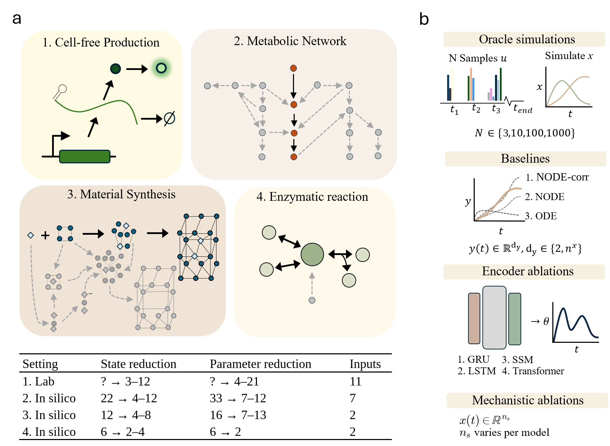

# Mechanistic Encoders for Latent Dynamics

This repository is the official implementation of Mechanistic Encoders for Latent Dynamics.

<!-- This repository is the official implementation of [Mechanistic Encoders for Latent Dynamics](https://arxiv.org/abs/0000.00000). -->

## Overview



**Overview:** Our framework evaluates bolus-to-parameter mapping across four distinct dynamical systems: cell-free production, metabolic networks, material synthesis, and enzymatic reactions. We test how various sequence encoders (GRU, Transformer, SSM) map discrete input events to mechanistic ODE parameters ($\theta$). The evaluation systematically explores the effects of state and parameter reduction on model identifiability, benchmarking our approach against standard neural and ODE baselines.

*`scaffolds.py` defines the scaffolds for all four domains — TXTL (M3, M4, M5, M7, M8, M9), MOF synthesis, glycolysis, and single-enzyme kinetics — plus the full model zoo. The end-to-end data pipeline shipped here covers the cell-free TXTL track; the ground-truth simulators for the other domains live in the research tree.*

All runnable scripts are located in the `last-layer-ode` directory. **Please run everything from the repository root.**

## Requirements

To install the necessary requirements:

```bash
pip install -r requirements.txt
```

## Data Generation

Before training, you must generate the synthetic datasets using the provided ODE simulators. Datasets are saved as `.npz` files.

Below are the basic commands to generate the primary 1000-sample datasets for our benchmark models:

**1. Glycolysis (Full 22-State Oracle)**
```bash
python last-layer-ode/create_dataset.py --model glycolysis_oracle22 \
    --t-span 20 --n-steps 400 --n-samples 1000 \
    --control-indices 0,12,13,14,15,16,17,18,19,20,21 \
    --obs-indices 0,1,2,3,4,5,6,7,8,9,10,11,12,13,14,15,16,17,18,19,20,21 \
    --seed 42 \
    --output-file datasets/glycolysis/glycolysis_oracle22_n1000.npz
```

**2. Single-Enzyme Kinetics**
```bash
python last-layer-ode/create_dataset.py --model single_enzyme \
    --t-span 30 --n-steps 200 --n-samples 1000 \
    --control-indices 0,1 \
    --obs-indices 0,1,2,3 \
    --seed 42 \
    --output-file datasets/single_enzyme/single_enzyme_4.npz
```

**3. MOF Synthesis (12-State)**
```bash
python last-layer-ode/create_dataset.py --model mof_synthesis \
    --t-span 30 --n-steps 300 --n-samples 1000 \
    --control-indices 4,5 \
    --obs-indices 0,1,2,3,4,5,6,7,8,9,10,11 \
    --output-file datasets/mof/mof_synthesis_12_n1000.npz
```

*(Note: Additional configurations for reduced states (e.g., 4, 6, 8 states) or smaller sample sizes can be generated by adjusting `--obs-indices` and `--n-samples` accordingly).*

**Cell-free (TXTL).** The real CFPS datasets are not shipped here. For a TXTL demo with the right schema (`['R','O','m','mm','p','pm','DNA']`, bolus controls, per-sample time grid), use:
```bash
python tests/make_synthetic_npz.py datasets/cell-free/synthetic_demo.npz
```
The real CFPS datasets are built from raw lab workbooks via `scripts/build_txtl_combined_npz.py` (raw data not included).

*(Note: `create_dataset.py` covers the ODE-simulated benchmark domains. The methane/combustion models require [Cantera](https://cantera.org), which is an optional dependency and not included.)*

## Training

To train a model, use the `train.py` script. Pass a configuration file and
override any config key via the CLI with `--set key=val`:

```bash
python last-layer-ode/train.py --config configs/scaffold_ladder_gru_M5.yaml --no-plot \
    --set dataset_path=datasets/cell-free/synthetic_demo.npz
```

Two example configs are provided in `configs/`:

* `scaffold_ladder_gru_M5.yaml` — GRU CMVF (`ode_rnn`) on the M5 resource+maturation scaffold.
* `encoder_zoo_slstm_M4.yaml` — sLSTM CMVF (`ode_slstm`) on the M4 three-state scaffold.

Reduce a run with e.g. `--set epochs=5`; for a dataset smaller than `val_n + test_n`
also pass `--set val_n=... --set test_n=...`. Unknown/removed keys in older configs
are ignored with a warning.

To check the codebase end-to-end (generates a tiny synthetic dataset and trains
each example config for one epoch):

```bash
python tests/test_smoke.py
```

## Evaluation

Our evaluation workflow centers around computing the Normalized Root Mean Square Error (NRMSE) and visually comparing trajectories. 

**Typical evaluation workflow:**

### 1. Compare runs — first call computes NRMSE and caches it to nrmse_cache.csv
```bash
python last-layer-ode/metrics/compare_runs.py experiments/scaffold_size_effect --csv results/result.csv
```

### 2. Plot NRMSE vs Scaffold Size (P) — reuses the cache
```bash
python last-layer-ode/metrics/plot_nrmse.py experiments/scaffold_size_effect --out results/scaffold_size_effect.pdf
```

### 3. Visual fit check — true vs. predicted trajectories for one sample
```bash
python last-layer-ode/metrics/plot_sample_fit_grid.py experiments/scaffold_size_effect
```

*Tip: If you retrain models and need to force a recomputation of the metrics, pass the `--recompute` flag to `compare_runs.py`.*

To run full diagnostic plots for a single run (loss curves, species heatmap, theta parameters, etc.):
```bash
python last-layer-ode/plot_diagnostics.py <path_to_run>
```

### Additional Analysis Tools

For deeper inspection into identifiability and per-step parameter fitting, use our analysis scripts.

**Oracle θ-fit across scaffolds.** Directly optimise a time-varying θ(t) per sample to find each scaffold's achievable fit ("ceiling") under a forward rollout — `--mode joint` optimises the whole θ-trajectory against the full rollout (the CMVF ceiling), `--mode greedy` re-fits θ at each step:
```bash
python last-layer-ode/analysis/oracle_fit_cfps.py --dataset datasets/cell-free/synthetic_demo.npz --mode joint --out results/oracle_fit
```

## Baselines

We include several baseline implementations in the `last-layer-ode/models/` directory for comparison:

* `neural_ode.py`: Pure neural ODE baseline (no mechanistic structure).
* `neural_ode_gru.py`: Black-box GRU baseline that predicts $\mathrm{d}y/\mathrm{d}t$ directly.
* `ode_rnn.py`: Mechanistic ODE-RNN baseline with GRU-inferred time-varying parameters.
* `ode_fixed_theta.py`: Constant-$\theta$ baseline (single global learnable parameter vector).
* `ode_fixed_theta_nn.py`: Hybrid baseline with fixed mechanistic $\theta$ plus neural correction.

## Acknowledgments

Our Mamba SSM encoder implementation builds on [mamba-ssm](https://github.com/state-spaces/mamba), the official reference implementation for state space models.

## License

This project is licensed under the MIT License
